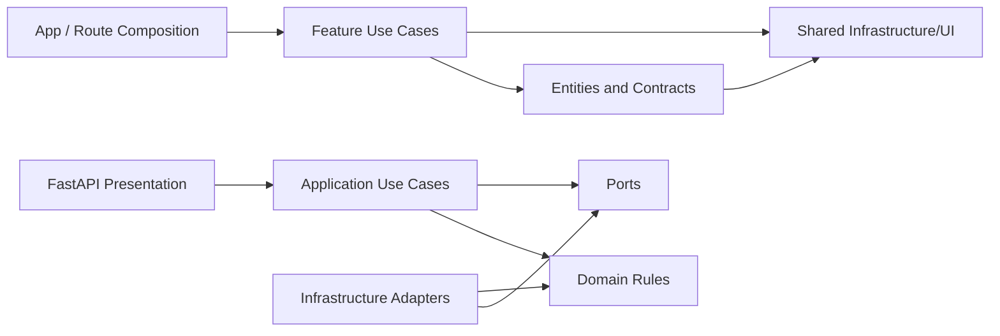

# Memory Anki Architecture

This directory is the current architectural source of truth. Product and runtime context lives in `AI_PROJECT_CONTEXT.md`; historical plans in `fable/` are not authoritative for current module ownership.

## System Shape

```text
apps/web: app -> pages/widgets -> features -> entities -> shared
apps/api: presentation -> application/use cases -> domain + ports <- infrastructure
```

The repository is a local-first Windows product used on two devices. SQLite, files, backups, PWA, and desktop clients share one local backend. Cross-device behavior must be deterministic because runtime data is synchronized outside Git.

## Ownership

| Capability | Frontend owner | Backend owner |
|---|---|---|
| Mind-map document rules | `entities/mindmap-document` | `modules/mindmap_document` |
| Generic mind-map rendering | `shared/ui/mindmap-canvas` | — |
| Mind-map editing runtime | `features/mindmap-editor` | aggregate-specific editor services |
| Palace aggregate | `entities/palace`, palace features | `modules/palaces` |
| Review scheduling/execution | review features/entities | `modules/reviews` |
| AI runtime selection/calls | AI configuration features | `platform.application.AiRuntimeProvider`; settings supplies the adapter |
| Background jobs | feature adapters | target shared job lease/handler infrastructure |
| Client preferences | `entities/preferences` | settings/profile preference endpoint |

## Hard Invariants

1. Pure document/domain modules do not import React, FastAPI, SQLAlchemy, file paths, or business aggregates.
2. Generic UI does not contain palace, review, mastery, segment, or other business fields; hosts translate them into visual capabilities.
3. GET/read projections do not mutate or commit business state.
4. Serializers do not repair aggregates. Repair and reconciliation are explicit commands or maintenance jobs.
5. Entity-scoped async operations carry `ownerId` and `operationId`; stale completion, failure, retry, and conflict actions are ignored.
6. Legacy normalization is deterministic across process restarts and devices. Never derive persisted IDs from memory addresses, random values, timestamps, or local paths.
7. Cross-module dependencies use a public facade, a typed port, or an application event. Private repositories and application internals are not shared APIs.
8. API inputs use explicit command/query models; compatibility envelopes are isolated and have a removal plan.

## Target Dependency Map



Feature-to-feature production imports are forbidden; cross-feature composition belongs in `pages` or `widgets`. Backend cross-context calls are allowed only when registered in the context map and imported through the target context's declared public `api` entry. Private application, infrastructure, and presentation modules are never cross-context APIs.

`docs/architecture/context-map.yaml` is the machine-readable architecture ledger. It inventories migrated backend contexts, records the explicit public cross-context dependency graph, enforces zero production feature-to-feature imports, and lists use cases whose transactions are managed through `UnitOfWork`. New dependency edges are rejected until intentionally designed and registered. The frontend ledger measures production imports only; test mocks and fixtures do not create runtime architecture debt.

Application transaction ownership is explicit: presentation constructs infrastructure adapters, application use cases depend on `memory_anki.platform.application.UnitOfWork`, and only the adapter calls the concrete ORM transaction.

Backend type boundaries are checked across the complete `memory_anki` package. Whole-module Mypy `ignore_errors` overrides are forbidden; unavoidable untyped third-party libraries may use only a narrowly scoped error-code ignore at the import site.

Frontend lint is a zero-warning contract. The `apps/web` lint script runs ESLint with `--max-warnings 0`; unused compatibility props and unresolved Hook dependency warnings must be fixed at their ownership boundary rather than suppressed.

## Migration Order

1. **Protect correctness:** owner-safe async saves, deterministic IDs, mandatory revision checks, atomic delivery of the mind-map migration.
2. **Separate reads from writes:** remove commits/reconciliation from GET handlers and serializers; introduce catalog/read projections.
3. **Break dependency cycles:** extract review content ports, AI runtime ports, backup events, and background job leases.
4. **Type the boundaries:** Pydantic request/response models, runtime frontend decoders, narrower mypy exceptions, stricter TypeScript by directory.
5. **Control performance:** one policy load per review query, paginated catalog projections, batched ORM loads, single-pass mind-map projection/layout.
6. **Retire compatibility:** remove legacy facades and architecture exceptions only after callers migrate and regression tests exist.

## Validation

- Fast iteration: `python tools/quality_gate.py`
- Full handoff: `python tools/quality_gate.py --full` (backend tests, frontend tests/build, and Playwright smoke)
- Windows launcher smoke after runtime/startup-sensitive changes: `python tools/quality_gate.py --launchers` (really runs `start-pwa.bat` and `start-desktop.bat`, verifies API/Electron readiness, then restores the shared PWA service)
- Mind-map architecture details: `docs/architecture/mindmap.md`
- AI runtime boundary: `docs/architecture/ai-runtime.md`
- Prompt catalog boundary: `docs/architecture/prompt-catalog.md`
- Review context boundary: `docs/architecture/review-boundary.md`
- Read-model purity: `docs/architecture/read-models.md`
- Dashboard composition boundary: `docs/architecture/dashboard-read-model.md`
- Palace Quiz boundary: `docs/architecture/palace-quiz-boundary.md`
- Consumer context boundaries: `docs/architecture/consumer-contexts.md`
- Backup context boundary: `docs/architecture/backup-boundary.md`
- Quiz frontend boundary: `docs/architecture/quiz-frontend-boundary.md`
- Knowledge context boundary: `docs/architecture/knowledge-boundary.md`
- Context and dependency ledger: `docs/architecture/context-map.yaml`
- Temporary file-level exceptions: `docs/architecture/boundary-exceptions.json`
## Mutation identity boundary

Request mutation IDs are represented by the framework-free `platform.application.MutationIdentity` contract. Presentation extracts an identity from request headers and uses the platform SQLAlchemy response-store adapter. Palace no longer imports the retired Persistence context; mutation responses participate in the use case's existing `UnitOfWork` transaction.

## Study session mutation commands

The five idempotent Study Session HTTP writes are composed by `sessions.application.study_session_commands`. Each command asks legacy persistence primitives to flush without committing, stores the mutation response through the platform adapter, and commits once through `UnitOfWork`. Sessions therefore has no dependency on the retired Persistence context.

English course/task HTTP wrappers are entity-owned under `apps/web/src/entities/english/api`; features and pages must not recreate `features/english/api`.

Frontend AI scenario/model selection and per-run overrides are entity-owned under `entities/ai-runtime`; business features consume this entity and must not recreate an `ai-config` feature.


## Runtime-owned workflows (architecture v2)

The concentrated architecture replacement has started with the two failure-prone learning-loop slices. New business code lives under `apps/web/src/modules`, browser effects live under `apps/web/src/platform`, and XState is restricted to `application/workflows`.

- `freestyle`: `canCompleteRound` is a framework-free domain guard; `FreestyleTrainingMachine` rejects scroll-driven completion.
- `mindmap`: `MindMapPresentationMachine` owns embedded/fullscreen transitions; `PresentationPort` owns native fullscreen, viewport locking, Escape handling, and layout scheduling.
- Cross-module imports must use the target module's `public.ts`.
- `docs/architecture/runtime-ports.yaml`, `use-case-catalog.yaml`, and `event-catalog.yaml` are the machine-readable runtime ownership ledger.
- The legacy FSD tree remains only for contexts not yet cut over; migrated runtime logic must not move back into it.
